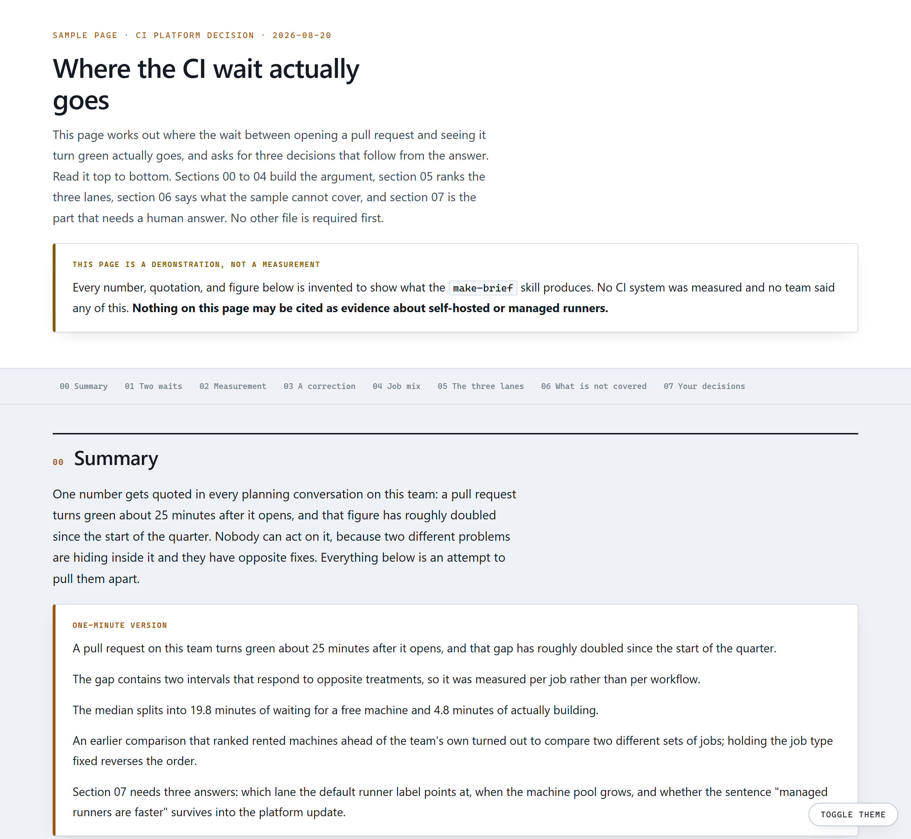
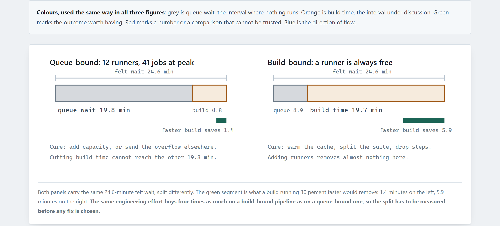

# smart-brief

一組 Claude Code 的 skill 與 hook，用本機、進得了版控的 HTML 簡報，取代內建的 Artifact 工具。

[English](README.md) · 繁體中文

Claude Code 可以把一個頁面發布成託管的 Artifact。這個 repo 做相反的事：一個 `PreToolUse` hook 擋掉那個工具，`make-brief` skill 改成把頁面寫進你自己的 repo──一個自帶完整骨架的 HTML 檔，放在 `docs/reports/` 底下，進得了 git，離線打得開，幾年後在一台沒有網路的機器上也讀得到。

## 安裝

這個 repo 本身就是一個 plugin marketplace，所以在 Claude Code 裡打兩行，skill 與 hook 會一起裝好：

```
/plugin marketplace add WatsonTsai/smart-brief
/plugin install smart-brief@smart-brief
```

看一下安裝完的摘要：如果它說 `Run /reload-plugins to activate.`，就跑那一行。然後叫 Claude 把東西發布成 artifact。它應該被擋下來，改去用那個 skill；skill 帶了 plugin 的命名空間，叫 `/smart-brief:make-brief`。

這個 hook 會去跑 `python`。如果你 PATH 上的 `python` 不存在或是 Python 2，請把 `hooks/hooks.json` 裡的 `command` 改成 `python3` 或直接寫直譯器的絕對路徑。

<details>
<summary><b>手動安裝（備案）</b>──給沒有 <code>/plugin</code> 指令的 Claude Code</summary>

<br>

1. 把 `skills/make-brief/` 複製到 `~/.claude/skills/`，`hooks/block-artifact.py` 複製到 `~/.claude/hooks/`。
2. 把 `examples/settings.snippet.windows.json`（或 `settings.snippet.unix.json`）併進 `~/.claude/settings.json`，並把 `YOUR_USERNAME` 換成真實的絕對路徑。
3. 重開 Claude Code，叫它把東西發布成 artifact。它應該被擋下來，改去用那個 skill。

上面那條關於 `python` 的說明在這裡一樣適用，改的是那個片段裡的 `command`。

</details>

## 產出長什麼樣



圖一律是 inline SVG，顏色全部讀 CSS 變數，所以切到深色模式會自動換色；圖說講的是「所以呢」，不是圖上有什麼：



那份頁面就附在 repo 裡，是 `examples/demo-brief.html`。在本機打開可以整份讀完、切到深色模式、直接列印。裡面的數字是編的，它的用途是展示格式。

## 為什麼要擋掉 Artifact

**留在你機器上的是半成品，不是那份頁面。** Claude Code 發布之前確實會先把檔案寫進你的專案，所以東西沒有遺失──但那份來源檔沒有 `<!doctype html>`、沒有 `<head>`、也沒有 charset 宣告，那層外殼是發布時由 host 補上的。單獨打開本機那份，看到的東西跟讀者看到的不一樣，非 ASCII 文字還可能直接亂碼。與此同時，一份完整副本躺在 Anthropic 的主機上，而且沒有一般的撤下方式，刪除要走合規 API。

**託管頁面的版型是為了「看起來已經完成」而設計的。** 這個模板是為了相反的任務：先講動機再談結果、在因果的關鍵步驟用 inline SVG、把證據強度與作者改變想法的地方明確標出來。一份可以被質疑的頁面，勝過一份看起來已成定論的頁面。

**把功能關掉，跟把它導去別的地方，不是同一件事。** Claude Code 本來就提供三種官方的停用方式──設定檔裡的 `"disableArtifact": true`、環境變數 `CLAUDE_CODE_DISABLE_ARTIFACT=1`、或把 `Artifact` 加進 `permissions.deny`。如果你要的只是讓這個功能消失，用那三種就夠了。hook 處理的是另外半個問題：功能單純被停用時，Claude 會退回寫一份沒有版型的裸檔；而 hook 的拒絕訊息會把這個 skill、章節結構與落點慣例一起交給它。這個擋法不是全有全無：`action: "list"` 是唯讀查詢、不會產生任何對外託管的內容，所以放行。

## 這個 skill 到底強制了什麼

- **動機先行。** 讀者缺的每一項前提知識，都要變成前面的一節。三十秒自檢是在大綱階段跑，不是等全文寫完才跑。
- **標題寫術語，論點寫進段落。** 寫「Queue time」，不寫「把兩種等待拆開需要每個 job 三個時間戳」。由完整句子組成的目錄得先讀完才能用，那就失去目錄的意義。每一節改成先講背景（這個問題從哪來）再談定義，節末收一句重點。
- **術語先定義再使用。** 附一支掃描腳本（`check_forward_refs.py`）列出每個術語第一次出現的位置——作者重讀自己的頁面看不出這種問題，因為你已經知道那些詞的意思。寫在標題裡不算定義。
- **每張圖都回答一個明確的「為什麼」。** 只用 inline SVG；所有 fill 與 stroke 都讀 CSS 變數，深色模式才會自動換色；箭頭用 `line` + `polygon` 手繪；圖說要講「所以呢」，不是描述圖上有什麼。
- **誠實有固定的形狀。** 一次自我修正要同時給三件事：原本說了什麼、為什麼那是錯的、現在該相信什麼。數字要標成實測、推估、或不可引用。任何拿來排序的指標，先做一次混淆檢查。每個決策項都要附上建議與理由。
- **更新等於重寫。** 同一份頁面補到第三次，章節順序就會變成作者的犯錯史。這個 skill 要求你重寫，並把被取代的舊檔留著、在最上面加一條指向新檔的橫幅。
- **一道句子層級的複查**：動作被埋進抽象名詞、代名詞指涉不明、比較級沒有基準、抽象詞沒有落地。
- **頁面永遠不是交付本體。** 主張、證據、你要決定什麼，仍然要寫在對話裡；HTML 是讓人深入的那一層。

## 什麼時候不要用

- **對話裡三段話講得完。** 那就講那三段。一份只是為了顯得完整而存在的頁面，對讀者是負擔不是幫助。
- **這份材料是要當場口頭講的。** 去做投影片。
- **產出是給 agent 或未來的 session 讀的持久化結論。** 一份 `docs/reports/*.md` 就夠了，不需要排版。
- **重點只是比大小。** 那是表格。這個 skill 會叫你少畫圖，不是多畫圖。
- **你要的是一個可以傳給 repo 以外的人的網址。** 那正是內建 Artifact 的用途，而且它做得很好。這個 plugin 是為了另一種情況存在的：那份頁面該待在程式碼旁邊，不是待在網路上。

## 檔案

```
.claude-plugin/
  plugin.json       plugin 資訊檔：名稱、版本、作者、授權
  marketplace.json  marketplace 目錄，讓這個 repo 可以安裝它自己
skills/make-brief/
  SKILL.md          skill 本體
  starter.html      完整骨架：tokens、reset、深淺兩套主題、主題切換、所有元件
  svg_patterns.md   四種可重用的示意圖樣式 + 顏色語意對照表
hooks/
  hooks.json        plugin 版的 hook 註冊，路徑走 ${CLAUDE_PLUGIN_ROOT}
  block-artifact.py PreToolUse hook：碰到 Artifact 工具 exit 2，放行 action="list"
examples/
  settings.snippet.windows.json   只有手動安裝會用到
  settings.snippet.unix.json      只有手動安裝會用到
  demo-brief.html   一份由這個 skill 產出的完整簡報（資料為虛構）
docs/
  demo-brief.png    上面那份的截圖
  demo-diagram.png  其中一張圖的特寫
```

## 幾點說明

- 在 Windows 上開發與使用。hook 與 skill 本身跟平台無關，skill 也把三個平台的開檔指令都印出來，但 Unix 版的安裝片段沒有在 macOS 或 Linux 上實跑過。
- `"matcher": "Artifact"` 比對的是官方文件裡列出的工具識別字，跟 `permissions.deny` 吃的是同一個字串。未來若這個工具改名，matcher 要跟著改。
- `starter.html` 是 `lang="en"`，字型堆疊的最後一項保留了一個中文字型當 fallback。這兩處都可以照你要寫的語言改掉。

## 授權

MIT
